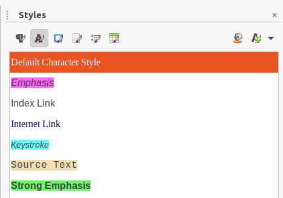

# odtclean.py
A script for cleaning odt files, i.e. removing direct character formatting. It is a useful preprocessing step for translation of odt files, since they may contain invisible and thus unnecessary formatting. The script removes all character formatting and therefore the required formatting must be changed manually to appropriate character styles.

An example:

Original text displayed by the OmegaT CAT tool:

```<f0>T</f0><f1>he </f1><i2/><f3>Menu bar </f3><f4>is where</f4><f5> you </f5><f6>select</f6><f7> one of the menus </f7><f8>and various </f8><f9> sub-menu</f9><f10>s</f10><f11> appear </f11><f12>giving you more</f12><f13> options.```

`<fxx>` are ODF tags abbreviated by OmegaT. They cannot be ignored or removed in OmegaT, since that may corrupt the document.

The same text after cleaning by the script:

```The <i0/>Menu bar is where you select one of the menus and various sub-menus appear giving you more options.```

## Usage

```
Usage:  ./odtclean.py switches
	-h                this usage
	-i input_file     a file to clean {./ifile.odt}
	-o output_file    a cleaned file {./ofile.odt}
```
Maybe that you will have to install some python3 modules.

In certain situations tags are not removed. In that case a message is written:

```
T[0-9]* tags not fixed:
```
followed by the list of not cleaned tags (which may be pretty complex):

```<text:span text:style-name="T10"><draw:frame draw:style-name="fr22" draw:name="Object3" text:anchor-type="as-char" svg:y="-0.619cm" svg:width="0.51cm" svg:height="1cm" draw:z-index="21"><draw:object xlink:href="./Object 7" xlink:type="simple" xlink:show="embed" xlink:actuate="onLoad"/><draw:image xlink:href="./ObjectReplacements/Object 7" xlink:type="simple" xlink:show="embed" xlink:actuate="onLoad"/></draw:frame></text:span```

These pose no problem for translation.

## Manual preprocessing
As the script removes all direct character formatting, one needs to change useful direct formatting to appropriate styles.

A tested procedure (using LibreOffice):
1. Open a document
1. Modify background of the used character styles (`Emphasis`, `Strong Emphasis`, etc), so that they are clearly visible in the text. The `LOGuidesStyles.oxt` extension may help.
1. Search for manual bold and italics (and maybe others) using the `Find & Replace` tool (`Attributes > Font Weight` or `Attributes > Font Posture`). Replace to the appropriate character style.
1. Text with style "undone" by direct formatting is visible thanks to the colored background of the style. Change its style to `Default Character Style`.
1. Revert the style background color to `None`.
1. Save the document

## Using the script
To keep track of the changes one can organize the files in three directories: `Original`, `Modified` and `Cleaned`. To clean a file from the `Modified` directory and save it to `Cleaned` one should run e. g.
```
odtclean.py -i GS6400-Preface.odt ../Cleaned/GS6400-Preface.odt
```
To clean all documents in the directory run (when using `bash`):
```
for i in *.odt; do echo $i; odtclean.py -i $i -o ../Cleaned/$i; done
```
## Verification of correctness
One can verify correctness of cleaning by opening a file from the `Modified` directory and comparing it with the corresponding file from the `Cleaned` directory by using `Edit > Track Changes > Compare Documents`. No differences should be displayed.
## The `LOGuidesStyles.oxt` extension
The extension can be used to `Highlight Character Styles` and to `Reset Character Styles`. These functions can be accessed either using a tool bar `Add On 2` or in `Tools > Add-Ons`.

Highlighted styles used in LO Guides:


